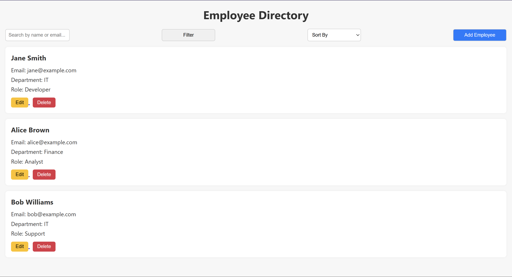
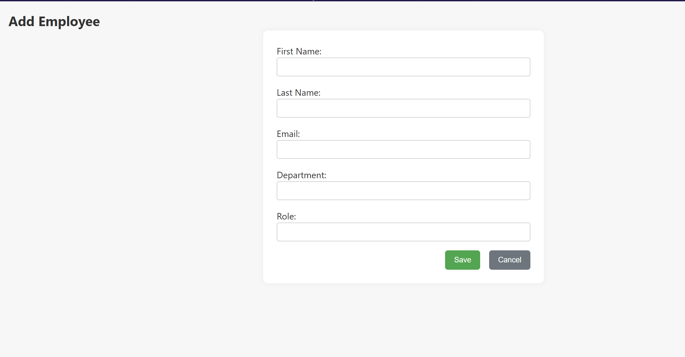
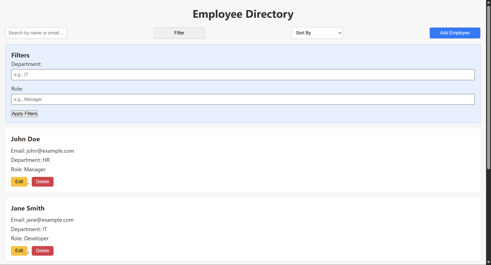

# 💼 Employee Directory

A responsive and interactive employee directory web application built using **Spring Boot**, **Freemarker**, and **Vanilla JavaScript**.

---

## 🚀 Setup and Run Instructions

### ✅ Prerequisites

* Java 17 or later installed
* Maven installed and added to `PATH`
* IDE or code editor like VS Code

### ▶️ Steps to Run the Project

```bash
# Clone or download the project
cd employee-directory

# Clean and install dependencies
mvn clean install

# Run the Spring Boot app
mvn spring-boot:run
```

> Once the server starts, open `http://localhost:8080` in your browser.

---

## 💂️ Project Structure

```
employee-directory/
🌐 src/
   └️ main/
       ├️ java/
       │   └️ com/example/employeedirectory/
       │       ├️ EmployeeDirectoryApplication.java     # Main Spring Boot application
       │       └️ controller/
       │           └️ EmployeeController.java           # Handles routes, logic
       └️ resources/
           ├️ static/
           │   ├️ css/
           │   │   └️ style.css                   # Main styles
           │   └️ js/
           │       ├️ app.js                        # Handles dashboard interactions
           │       └️ form.js                       # Handles form submission logic
           └️ templates/
               ├️ dashboard.ftlh                # Main dashboard view
               └️ add-edit-form.ftlh            # Add/Edit form view

pom.xml                           # Maven dependencies
README.md                         # Project overview (you are here)
```

---

## 📸 Screenshots

| 📋 Dashboard | ➕ Add/Edit Form | 🔍 Filter/Search |
| ------------ | --------------- | ---------------- |
|  |  |  |

---

## 🧠 Reflection

### ⚡️ Challenges Faced

* 🧩 Managing state between hardcoded and newly added employees
* ❗ JavaScript interactions causing full page reloads for search/filter initially
* 🔐 Form submission errors due to Freemarker context mismatch or empty/null handling

### ✨ Improvements

* Introduce real backend persistence (like H2 or MySQL DB)
* Use Spring Model classes instead of raw Maps
* Make search/filter logic dynamic using JS (avoid full page reload)
* Improve UI/UX with animations, transitions, and validations
